 

 

 

<table align="center"><tr><td width="600" align="center">

I'm Aditi — a Computer Science student who spends more time than I'd like to admit staring at a screen wondering why something broke, and slightly less time figuring out why it suddenly worked. Everything below is what came out of that process.

</td></tr></table>

 

---

# ✦ MY REPOSITORY GALAXY ✦

### *a collection of little worlds I've built*

 

<!-- REPOSITORIES:START -->

 

 

 

 

 

 

<!-- REPOSITORIES:END -->

---

# ✧ RECENT SIGNALS ✧

*the latest activity detected from my universe*

 

<!-- RECENT:START -->

<a href="https://github.com/aditi-0926/aditi-0926">
<b>✦ aditi-0926</b>
</a>
&nbsp; · &nbsp;
23h ago
  
<a href="https://github.com/aditi-0926/sentiment-service">
<b>✦ sentiment-service</b>
</a>
&nbsp; · &nbsp;
1 week ago
  
<a href="https://github.com/aditi-0926/house-price-prediction-system">
<b>✦ house-price-prediction-system</b>
</a>
&nbsp; · &nbsp;
3 weeks ago

<!-- RECENT:END -->

---
