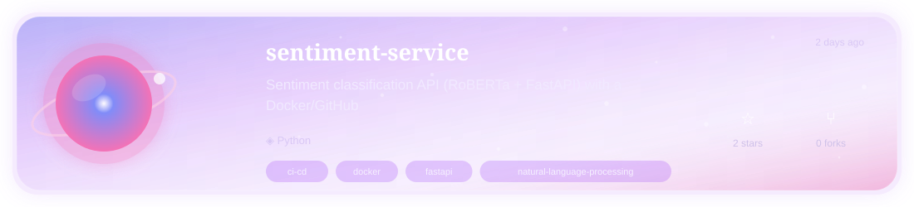
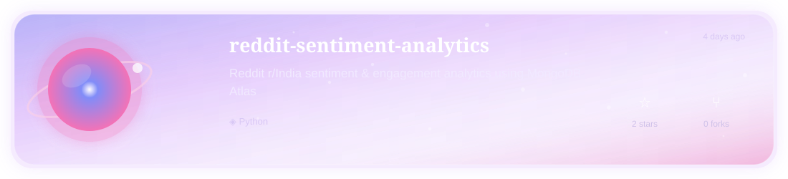

## About Me

Data Science and AI-focused student working at the intersection of data, machine learning, and intelligent systems. My work spans predictive modeling, NLP, recommendation systems, data analytics, and AI-driven applications.

I build end-to-end solutions that transform raw data into actionable insights and intelligent outcomes, covering data preparation, analysis, model development, evaluation, visualization, and deployment.

# ✦ MY REPOSITORY GALAXY ✦
 

<!-- REPOSITORIES:START -->

 

 

 

 

 

 

 

 

<!-- REPOSITORIES:END -->

---

# ✧ RECENT SIGNALS ✧

*the latest activity detected from my universe*

 

<!-- RECENT:START -->

<a href="https://github.com/aditi-0926/aditi-0926">
<b>✦ aditi-0926</b>
</a>
&nbsp; · &nbsp;
23h ago
  
<a href="https://github.com/aditi-0926/Movie-recommendation-system">
<b>✦ Movie-recommendation-system</b>
</a>
&nbsp; · &nbsp;
1 day ago
  
<a href="https://github.com/aditi-0926/CustomerPulse">
<b>✦ CustomerPulse</b>
</a>
&nbsp; · &nbsp;
3 days ago

<!-- RECENT:END -->

---
